# Guía Completa de Despliegue en Coolify
## En las Nubes Restobar - Pipeline de Producción Automatizado

**Última actualización:** 17 de Octubre 2025
**Versión:** 1.0.0
**Estado:** Production-Ready ✅

---

## 📋 Índice

1. [Requisitos Previos](#requisitos-previos)
2. [Arquitectura de Despliegue](#arquitectura-de-despliegue)
3. [Configuración Inicial](#configuración-inicial)
4. [Pipeline CI/CD](#pipeline-cicd)
5. [Despliegue Manual](#despliegue-manual)
6. [Monitoreo y Salud](#monitoreo-y-salud)
7. [Rollback y Recuperación](#rollback-y-recuperación)
8. [Optimización y Mantenimiento](#optimización-y-mantenimiento)
9. [Troubleshooting](#troubleshooting)
10. [Checklist de Producción](#checklist-de-producción)

---

## 🎯 Requisitos Previos

### Infraestructura Requerida

- **VPS con Coolify instalado** (mínimo 2GB RAM, 1 CPU, 20GB SSD)
- **Docker y Docker Compose** configurados
- **Nginx Proxy Manager** (opcional, para SSL)
- **Dominio configurado** con DNS apuntando al VPS
- **Cuenta de GitHub** con permisos para el repositorio

### Stack de la Aplicación

- **Runtime:** Node.js 20.x
- **Build Tool:** Vite 6.0+
- **Web Server:** Nginx Alpine
- **Container:** Multi-stage Docker
- **Orchestration:** Docker Compose

### Servicios Externos

- **Google Tag Manager** (analíticas)
- **Sentry** (error tracking)
- **Cartamenú.com** (menú y productos)
- **Celebrarlo.com** (reservas)
- **RestaurantGuru.com** (reviews)

---

## 🏗️ Arquitectura de Despliegue

```
┌─────────────────────────────────────────────────────────────┐
│                    GitHub Repository                       │
│                  en-las-nubes-website                      │
└─────────────────────┬───────────────────────────────────────┘
                      │ GitHub Actions CI/CD
                      ▼
┌─────────────────────────────────────────────────────────────┐
│                    Docker Registry                         │
│                  ghcr.io/enlasnubes                        │
└─────────────────────┬───────────────────────────────────────┘
                      │ Coolify Automatic Deployment
                      ▼
┌─────────────────────────────────────────────────────────────┐
│                     Coolify VPS                           │
│  ┌─────────────┐  ┌─────────────┐  ┌─────────────────┐   │
│  │   Nginx     │  │   App       │  │    Monitor      │   │
│  │  (Proxy)    │  │ Container   │  │   (Prometheus)  │   │
│  └─────────────┘  └─────────────┘  └─────────────────┘   │
└─────────────────────┬───────────────────────────────────────┘
                      │ Internet
                      ▼
┌─────────────────────────────────────────────────────────────┐
│                  enlasnubes.tudominio.com                  │
│              (PWA Cinematográfica Gastronómica)           │
└─────────────────────────────────────────────────────────────┘
```

### Componentes de Contenedor

```yaml
# Estructura del contenedor Docker
/usr/share/nginx/html/
├── index.html              # Entry point SPA
├── manifest.json           # PWA manifest
├── sw.js                   # Service Worker
├── assets/
│   ├── main.css           # CSS optimizado
│   ├── main.js            # JavaScript bundle
│   ├── vendor-*.js        # Vendor chunks
│   └── images/            # Assets optimizados
└── api/health             # Health endpoint
```

---

## ⚙️ Configuración Inicial

### 1. Configurar Repositorio GitHub

```bash
# Clonar repositorio
git clone https://github.com/tu-org/en-las-nubes-website.git
cd en-las-nubes-website

# Verificar archivos de despliegue
ls -la Dockerfile docker-compose.yml nginx.conf healthcheck.sh
```

### 2. Configurar Secrets de GitHub

Ejecutar el script automatizado:

```bash
chmod +x scripts/setup-coolify-secrets.sh
./scripts/setup-coolify-secrets.sh
```

O configurar manualmente en GitHub → Settings → Secrets:

```bash
# Secrets requeridos:
COOLIFY_SERVER_URL=https://coolify.tudominio.com
COOLIFY_API_KEY=tu_api_key_de_coolify
COOLIFY_APPLICATION_ID=tu_application_id
COOLIFY_APP_URL=https://enlasnubes.tudominio.com

# Secrets de aplicación:
VITE_API_BASE_URL=/api
CARTAMENU_API_KEY=tu_api_key_cartamenu
CELEBRARLO_API_KEY=tu_api_key_celebrarlo
RESTAURANTGURU_API_KEY=tu_api_key_restaurantguru

# Secrets de monitoreo:
GTM_ID=GTM-XXXXXXX
SENTRY_DSN=https://xxxx@sentry.io/xxxxx

# Secrets de notificaciones:
SLACK_WEBHOOK_URL=https://hooks.slack.com/XXXXX
NOTIFICATION_EMAIL=admin@enlasnubes.tudominio.com
```

### 3. Configurar Coolify

#### 3.1 Crear Aplicación en Coolify

1. **Login en Coolify Dashboard**
2. **New Application → Docker**
3. **Repository:** GitHub → en-las-nubes-website
4. **Branch:** main
5. **Dockerfile Path:** `./Dockerfile`
6. **Port:** 80

#### 3.2 Configurar Variables de Entorno

```bash
# Variables de Coolify:
NODE_ENV=production
NGINX_HOST=enlasnubes.tudominio.com
NGINX_PORT=80
APP_PORT=8080

# Recursos para VPS:
CPU_LIMIT=1.0
MEMORY_LIMIT=512M
CPU_RESERVATION=0.5
MEMORY_RESERVATION=256M
```

#### 3.3 Configurar Dominio y SSL

1. **Domain:** enlasnubes.tudominio.com
2. **SSL:** Let's Encrypt automático
3. **Proxy:** Nginx Proxy Manager
4. **Health Check:** `/api/health`

---

## 🔄 Pipeline CI/CD

### Workflow Automático

```mermaid
graph LR
    A[Push a main] --> B[GitHub Actions]
    B --> C[Tests & Linting]
    C --> D[Build Docker Image]
    D --> E[Push to Registry]
    E --> F[Coolify Deploy]
    F --> G[Health Checks]
    G --> H[Notifications]
    G -->|Falla| I[Rollback Automático]
```



### Archivo de Workflow: `.github/workflows/coolify-deploy.yml`

#### Jobs del Pipeline:

1. **test** - Validación de código y pruebas
2. **build** - Build de Docker image
3. **deploy** - Despliegue automático en Coolify
4. **notify** - Notificaciones de éxito
5. **rollback** - Recuperación automática ante fallos

### Triggers del Pipeline

```yaml
# Automatic triggers:
on:
  push:
    branches: [main]
  workflow_dispatch:  # Manual trigger
    inputs:
      environment:
        type: choice
        options: [production, staging]
```

---

## 🚀 Despliegue Manual

### Opción 1: Via GitHub Actions

```bash
# 1. Ir a GitHub → Actions
# 2. Seleccionar "Deploy to Coolify VPS"
# 3. Click en "Run workflow"
# 4. Elegir environment: production
# 5. Monitorizar progreso
```

### Opción 2: Via Coolify Dashboard

```bash
# 1. Login en Coolify
# 2. Seleccionar aplicación
# 3. Click en "Deploy"
# 4. Elegir branch: main
# 5. Confirmar despliegue
```

### Opción 3: Via CLI (Testing Local)

```bash
# Testing local antes de producción
chmod +x scripts/deploy-local.sh
./scripts/deploy-local.sh full

# Acceder a la aplicación de prueba
open http://localhost:8080
```

---

## 📊 Monitoreo y Salud

### Health Checks Automáticos

#### Endpoint Principal: `/api/health`

```json
{
  "status": "ok",
  "timestamp": "2025-10-17T12:00:00.000Z",
  "server": "enlasnubes-web",
  "version": "1.0.0"
}
```

#### Health Checks Configurados

```yaml
# docker-compose.yml
healthcheck:
  test: ["CMD", "curl", "-f", "http://localhost:80/api/health"]
  interval: 30s
  timeout: 10s
  retries: 3
  start_period: 40s
```

### Monitoreo de Recursos

#### Métricas Disponibles:

- **CPU Usage:** límite 1.0 core
- **Memory Usage:** límite 512MB
- **Disk Usage:** monitoreo continuo
- **Network Latency:** < 2s target
- **Response Time:** < 3s target

#### Prometheus Metrics

```bash
# Endpoint de métricas
http://localhost:9113/metrics

# Métricas clave:
nginx_http_requests_total
nginx_upstream_response_time_seconds
container_memory_usage_bytes
container_cpu_usage_seconds_total
```

### Logs y Auditoría

#### Logs de Aplicación

```bash
# Ver logs en tiempo real
docker logs -f enlasnubes-web

# Logs de Coolify
coolify logs application enlasnubes-web
```

#### Logs de Nginx

```bash
# Access logs
/var/log/nginx/access.log

# Error logs
/var/log/nginx/error.log
```

---

## 🔄 Rollback y Recuperación

### Rollback Automático

El sistema ejecuta rollback automático cuando:

- Health check falla por > 3 intentos
- Response time > 5 segundos continuo
- Error rate > 10% en 5 minutos
- Deployment falla en cualquier etapa

### Rollback Manual

#### Via Script:

```bash
chmod +x scripts/rollback-coolify.sh

# Rollback automático al último éxito
./scripts/rollback-coolify.sh auto "Problemas detectados"

# Rollback a deployment específico
./scripts/rollback-coolify.sh manual abc123-def456 "Rollback manual solicitado"
```

#### Via Coolify Dashboard:

1. **Seleccionar aplicación**
2. **Ir a Deployments**
3. **Seleccionar deployment exitoso**
4. **Click en "Rollback"**
5. **Confirmar acción**

### Backup Automático

```bash
# Backups programados:
BACKUP_SCHEDULE=0 2 * * *  # Daily at 2 AM
BACKUP_RETENTION_DAYS=30

# Ubicación de backups:
- S3 Bucket: enlasnubes-backups
- Local: /var/backups/coolify/
```

---

## ⚡ Optimización y Mantenimiento

### Optimización de Contenedor

#### Build Optimizado:

```dockerfile
# Multi-stage build:
# Stage 1: Builder (Node.js 20 Alpine)
# Stage 2: Production (Nginx Alpine)
# Resultado: ~50MB final image size
```

#### Caching Strategy:

```nginx
# Cache por tipo de contenido:
location ~* \.(css|js|png|jpg|jpeg|gif|svg|ico|woff|woff2)$ {
    expires 1y;
    add_header Cache-Control "public, immutable";
}

# Service Worker sin cache:
location ~* sw\.js$ {
    expires 0;
    add_header Cache-Control "no-cache, no-store, must-revalidate";
}
```

### Optimización de Red

```nginx
# Gzip y Brotli:
gzip on;
gzip_comp_level 6;
gzip_types text/css application/javascript image/svg+xml;

# HTTP/2 (con SSL):
listen 443 ssl http2;

# Optimización TCP:
tcp_nopush on;
tcp_nodelay on;
keepalive_timeout 65;
```

### Optimización de PWA

```javascript
// Service Worker strategies:
runtimeCaching: [
  {
    urlPattern: ({ request }) => request.destination === 'image',
    handler: 'CacheFirst',
    options: {
      cacheName: 'image-cache',
      expiration: { maxEntries: 60, maxAgeSeconds: 2592000 }
    }
  },
  {
    urlPattern: ({ request }) => request.destination === 'document',
    handler: 'NetworkFirst',
    options: { cacheName: 'page-cache' }
  }
]
```

### Mantenimiento Programado

#### Tareas Diarias:

```bash
# 1. Monitorear health checks
# 2. Revisar logs de errores
# 3. Verificar uso de recursos
# 4. Validar backups automáticos
```

#### Tareas Semanales:

```bash
# 1. Actualizar dependencias
# 2. Revisar métricas de rendimiento
# 3. Limpiar logs antiguos
# 4. Test de recuperación de desastres
```

#### Tareas Mensuales:

```bash
# 1. Actualizar Docker images
# 2. Revisar configuración de seguridad
# 3. Optimizar configuración de nginx
# 4. Reporte de rendimiento
```

---

## 🔧 Troubleshooting

### Problemas Comunes

#### 1. Container No Inicia

```bash
# Verificar logs:
docker logs enlasnubes-web

# Posibles causas:
- Permisiones incorrectas
- Variables de entorno faltantes
- Conflictos de puerto
- Recursos insuficientes
```

#### 2. Health Check Falla

```bash
# Verificar endpoint:
curl -f http://localhost:8080/api/health

# Posibles soluciones:
- Revisar configuración de nginx
- Verificar archivos estáticos
- Chequear recursos disponibles
- Revisar variables de entorno
```

#### 3. Despliegue Lento

```bash
# Optimizar build time:
- Usar Docker layer caching
- Excluir archivos innecesarios (.dockerignore)
- Optimizar npm dependencies
- Usar multi-stage builds
```

#### 4. SSL/TLS Issues

```bash
# Verificar certificado:
openssl s_client -connect enlasnubes.tudominio.com:443

# Soluciones:
- Renew Let's Encrypt certificate
- Verificar configuración de proxy
- Chequear DNS configuration
- Validar chain certificates
```

### Comandos de Diagnóstico

```bash
# Estado del sistema:
docker ps
docker stats
docker system df

# Verificación de red:
curl -I http://localhost:8080
nslookup enlasnubes.tudominio.com
ping enlasnubes.tudominio.com

# Recursos del VPS:
free -h
df -h
top
htop
```

### Logs Específicos

```bash
# Logs de aplicación:
docker logs enlasnubes-web --tail 100

# Logs de nginx:
docker exec enlasnubes-web tail -f /var/log/nginx/access.log
docker exec enlasnubes-web tail -f /var/log/nginx/error.log

# Logs de Coolify:
coolify logs server
coolify logs deployment
```

---

## ✅ Checklist de Producción

### Pre-Despliegue

- [ ] **Repositorio listo** en rama main
- [ ] **Tests pasados** (unit, integration, e2e)
- [ ] **Linting aprobado** (ESLint, Stylelint)
- [ ] **Build exitoso** localmente
- [ ] **Docker image probada** localmente
- [ ] **Secrets configurados** en GitHub
- [ ] **Coolify application creada**
- [ ] **Dominio configurado** con DNS
- [ ] **SSL certificate** generado

### Post-Despliegue

- [ ] **Health check funcionando**
- [ ] **Aplicación accesible** en dominio
- [ ] **Service Worker activo**
- [ ] **PWA Manifest válido**
- [ ] **Analíticas configuradas**
- [ ] **Error tracking activo**
- [ ] **Monitoreo operativo**
- [ ] **Backup automático** programado
- [ ] **Notificaciones funcionando**

### Validación Final

- [ ] **Performance test** (< 3s load time)
- [ ] **Mobile responsive** test
- [ ] **Accessibility check** (WCAG 2.1 AA)
- [ ] **Security scan** (headers, SSL)
- [ ] **Cross-browser test** (Chrome, Firefox, Safari)
- [ ] **PWA installation test**
- [ ] **Offline functionality test**
- [ ] **Push notifications test** (si aplica)

---

## 📞 Soporte y Contacto

### Equipo de Despliegue

- **DevOps Lead:** [Nombre] - [email]
- **Frontend Lead:** [Nombre] - [email]
- **Infrastructure:** [Nombre] - [email]

### Recursos de Ayuda

- **Documentación Coolify:** https://coolify.io/docs
- **GitHub Repository:** https://github.com/tu-org/en-las-nubes-website
- **Slack Channel:** #enlasnubes-deploys
- **Emergency Contact:** [teléfono]

### Alertas y Escalation

```
Level 1: Automated rollback
Level 2: DevOps team notification
Level 3: Full team escalation
Level 4: Management notification
```

---

## 📈 Métricas de Éxito

### KPIs de Despliegue

- **Deployment Time:** < 5 minutos
- **Downtime:** < 30 segundos
- **Rollback Time:** < 2 minutos
- **Success Rate:** > 95%
- **Uptime:** > 99.9%

### KPIs de Aplicación

- **Page Load Time:** < 3 segundos
- **Time to Interactive:** < 2 segundos
- **Lighthouse Score:** > 90
- **PWA Install Rate:** > 5%
- **Error Rate:** < 1%

---

**🎉 ¡Felicidades!** Tu aplicación "En las Nubes Restobar" está lista para despliegue production-ready en Coolify con automatización completa.

---

*Este documento es mantenido por el equipo de DevOps. Última actualización: 17 Octubre 2025*